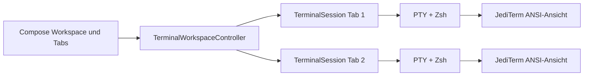

# Architektur von Shady

## Laufzeitmodell

Der Desktop-Emulator besitzt einen `TerminalWorkspaceController`. Jeder Tab wird
durch genau eine `TerminalSession` repräsentiert; in Produktion ist das eine
`PtyTerminalSession` mit Pty4J, Zsh und einem JediTerm-Widget.



`TerminalSession` kapselt Schreiben, Ctrl+C, Clear, Resize, Fokus, Key-Listener
und Close. Eine `TerminalSessionFactory` macht den Controller ohne echte PTY und
ohne Swing testbar. Der ältere Output-Accumulator-/Detached-Window-Pfad wurde
entfernt.

`ProcessCommandExecutor` bleibt ausschließlich für direkte CLI-Aufrufe außerhalb
des Emulators erhalten. Interaktive Emulatorbefehle laufen niemals darüber.

## Shell-Integration

Für jede PTY-Session erzeugt Shady ein temporäres `ZDOTDIR` und eine `.zshrc`.
Diese lädt zuerst die Nutzerkonfiguration und ergänzt anschließend:

- `preexec`-/`precmd`-Hooks für Command-, Exit-Code- und Arbeitsordnerereignisse
- ZLE-Normalisierung für optionale beziehungsweise wiederholte `shady`-Präfixe
- Funktionen für Shady-Built-ins und Emulator-Toolfenster
- Zsh-Completion für Shady sowie native Command-/Pfad-Completion
- projektweite Aliases und den konfigurierten Prompt

Ereignisse laufen über eine temporäre FIFO getrennt vom sichtbaren
Terminal-Output. `sys` und `windows` melden interne Toolfensterereignisse an den
Workspace. Normale Befehle bleiben echte Zsh-Befehle und behalten dadurch
Shell-Zustand, Job Control und interaktive Eingaben.

Wenn Sudo-Vorabprüfung aktiv ist, sendet der Controller genau einmal pro
App-Start `sudo -k; sudo -v` an die erste bereite Session. Der Passwortdialog und
Echo-Modus gehören vollständig der PTY-Shell.

## Darstellung und Features

- JediTerm verarbeitet ANSI, Alternate Screen, Maus, Resize und Scrollback.
- `AnsiOutputColorizer` ergänzt nur unformatierte Ausgabe. Er lädt Regeln bei
  jedem Command-Start neu, respektiert native SGR-Sequenzen und gibt Dateitypen
  Vorrang vor Command-Farben.
- Ctrl+R öffnet die Fuzzy-Palette als Compose-Panel im Hauptfenster. Treffer
  stammen aus History, Aliases, Shady-Kommandos, `PATH` und dem Arbeitsordner.
- `WorkspaceStateRepository` speichert Tabtitel, Arbeitsordner und aktiven Tab
  unter `~/.local/state/shady/workspace.json`.

## Konfiguration und Persistenz

Globale Dateien:

```text
~/.config/shady/config.json
~/.config/shady/colors.json
~/.config/shady/styles/
~/.local/state/shady/workspace.json
~/.local/state/shady/updates.json
```

Projektdateien können Terminal- und Featurewerte sowie Farbregeln überschreiben.
Security- und Update-Konfiguration bleiben global. Unbekannte alte JSON-Felder
werden ignoriert, damit bestehende Installationen lesbar bleiben.

## Distribution und IDEA

`installDist` erzeugt eine macOS-spezifische Distribution. Der Release-Workflow
baut Intel- und Apple-Silicon-Archive samt SHA-256-Dateien. Der Installer legt
jede Version in einem eigenen Releaseordner ab und tauscht nur den Launcher-Link.

Das IntelliJ-Plugin verwendet die Reworked-Terminal-API, sucht die installierte
Shady-Binary und öffnet `--ide-shell` als Terminaltab. In diesem Modus wird Zsh
mit derselben Alias-, Prompt- und Completion-Integration gestartet, aber ohne
Compose-Workspace oder eigene Toolfenster.

## Verifikation

```bash
./gradlew test -PskipIntellijPlugin=true
SHADY_PTY_INTEGRATION=true ./gradlew test -PskipIntellijPlugin=true
./gradlew installDist -PskipIntellijPlugin=true
./gradlew -p intellij-plugin test buildPlugin
bash -n scripts/install.sh scripts/install-dev.sh scripts/update.sh
```

Die Tests decken Routing, Konfiguration, Farben, Zsh-Skript, PTY-Eingabe und
Ctrl+C, Fuzzy Search, Workspace-Tabs, sudo-Einmaligkeit, Prozessabbruch und den
Installer ab.
